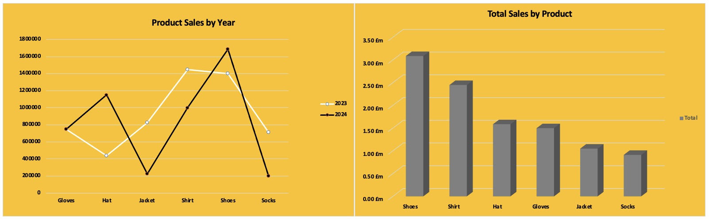
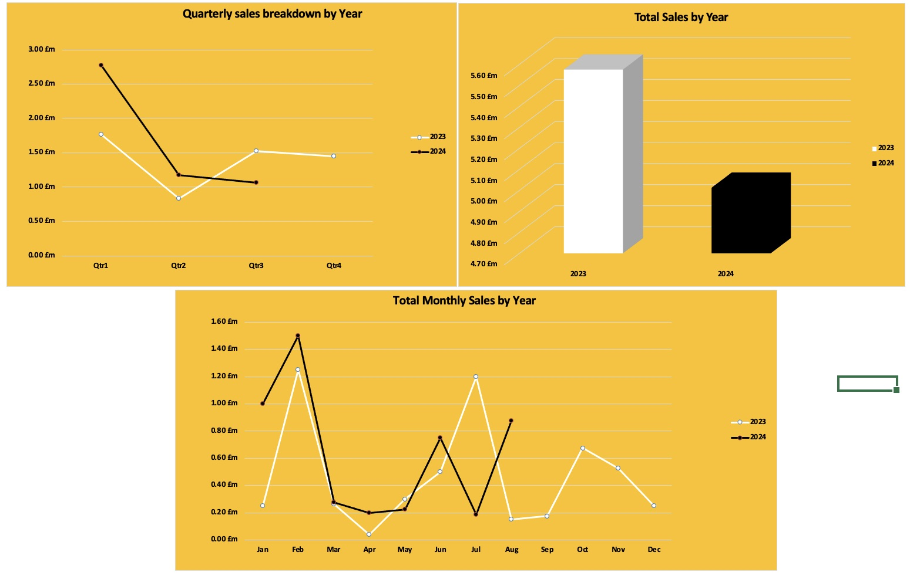
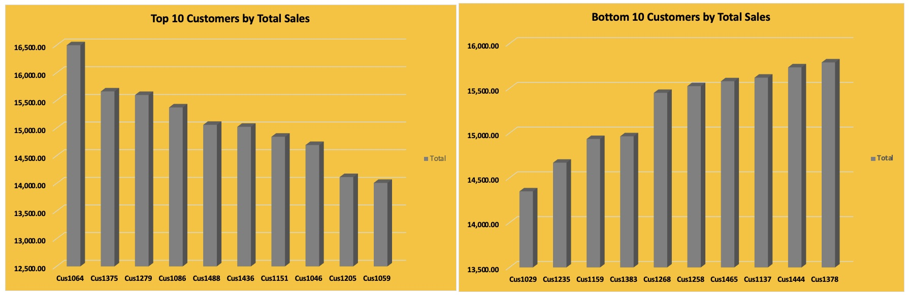

# Sales Data
## Project Title: Kikelomo Stores Sales Analysis


### Introduction
This is a Microsoft Excel project on sales analysis of an imaginary store called **Kikelomo Stores**. 
The project is aimed at analysing and deriving insights to answer critical questions and help the store make data driven decusions.
**_Disclaimer_**: _All datasets and reports do not represent any company, institution or country but a dummy dataset to demonstrate the cabability of Microsoft  Excel._

### Problem Statement
- Which region generates the highest sales ?
- Which region generates the least sales ?
- Which product has the highest total sales ?
- What is the total sales trend year-on-year ?
- What is the total sales trend quarter-on-quarter ?
- Which product has the highest sales  year-on-year?
- What are the top 3 products by total sales? 
- What are the bottom 3 products by total sales?
- Who are the top 10 customers?
- Any other relevant insights.

### Excel Concept applied
-Excel functions; IF, IFS, TRIM, X-LOOKUP
-Pivot tables
-filters
-Slicers.

### Data Source
The data was obtained from an open-source data site as a CSV file, after which it was cleaned, analysed, and visualized with Microsoft Excel.

### Data Transformation and cleaning
To clean the data, duplicates and blanks were removed from from the table using the " Remove duplicate" and "filter" button in excel.
A new column was also created for  **TotalSales** using the formula.
``` excel
 UnitPrice * Quantity
```
### Data Analysis and Visualization
The report comprises of 
- Regional History
- Yearly History
- Product History
- Customer History

#### Regional History

South showed the highest sales in both 2023 and 2024 while the west region indicated the least sales in both year.

#### Product History



#### Yearly History


#### Customer History



### From the dashboard we could discover the following insights;
1.	The West region significantly outperformed others in total sales, reaching $4.68 million, followed by the East at $2.45 million, the South at $1.95 million, and North trailing with $1.51 million.
2.	In 2023, the South region led in sales, with West showing the least sales while the 2024 sales showed  South continued to lead, followed by East, with West again showing the lowest sales
3.	In 2023, shirts had the highest sales among products, while hats struggled to gain traction. By 2024, we observed dips in jacket and sock sales, while hats and shoes saw an increase.
4.	Comparing 2023 and 2024 quarterly trends, Q1 sales were higher in 2024, though both years experienced significant drops in Q2—more severe in 2023. While 2023 saw a rebound in Q3, 2024 continued to decline
5.	Monthly sales trends indicate February as the peak sales month in both years, with April and July showing consistent dips


